# EBD: Database Specification Component

Helluva is an information system with a web interface to collaboratively manage events.

## A4: Conceptual Data Model

This component groups the artifacts to be made by the development team in order to support the storage and retrieval requirements identified in the requirements specification.

### 4.1 Class Diagram
The UML diagram in Figure 1 presents the main organisational entities, the relationships between them, attributes and their domains, and the multiplicity of relationships for the MediaLibrary platform.

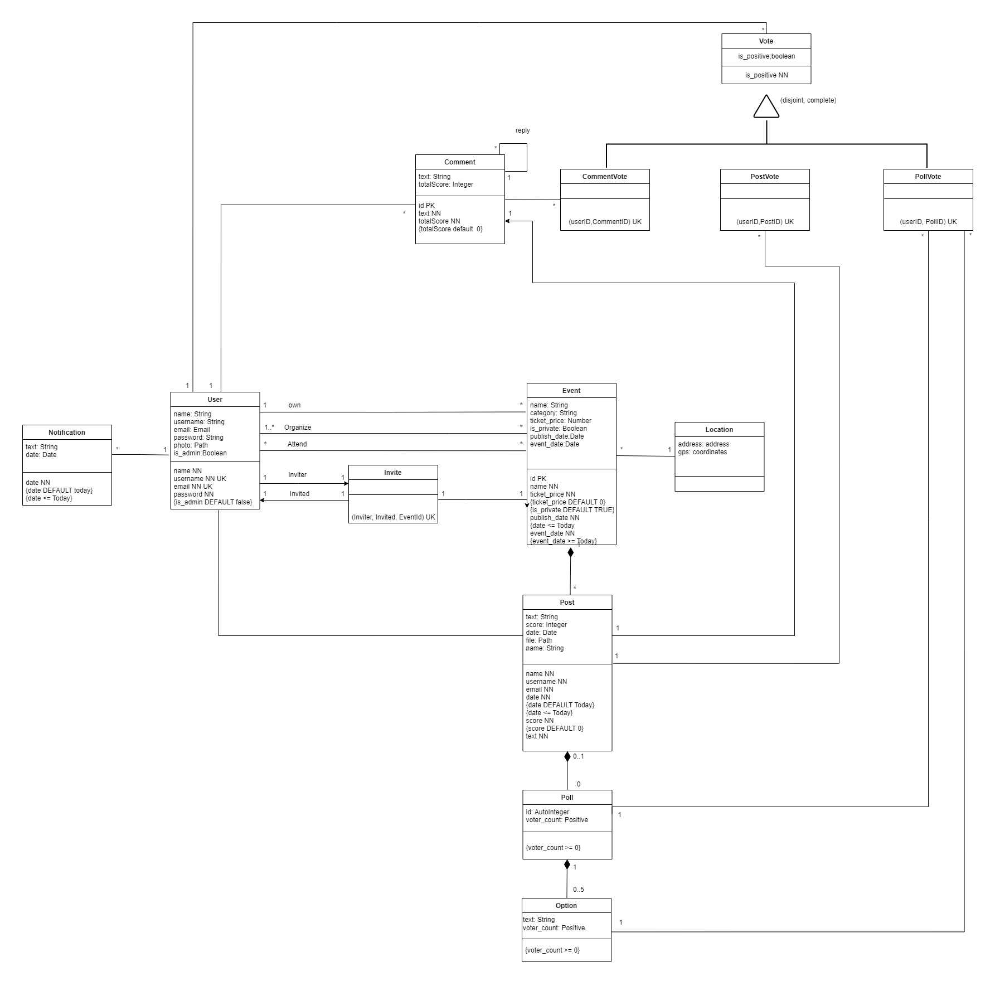

Figure 1: Database UML diagram.

### 4.2 Additional Business Rules
Additional business rules or restrictions that cannot be conveyed in the UML class diagram, are described in text as UML notes in the diagram or as independent notes in this section.

- Public events are shown in search results, whereas private events aren't.
- When a user deletes their account, the events and comments belonging to them are kept in order to uphold consistency.
- A user can both comment and vote on their own comments. 
- The date for an event must be greater than the date of its creation.

## A5: Relational Schema, validation and schema refinement

This artifact contains the Relational Schema obtained by mapping from the Conceptual Data Model. The Relational Schema includes each relation schema, attributes, domains, primary keys, foreign keys and other integrity rules: UNIQUE, DEFAULT, NOT NULL, CHECK.

### 5.1 Relational Schema
| Relation reference | Relation Compact Notation                        |
| ------------------ | ------------------------------------------------ |
| R01                | Event(__id__, location_id → Location NN, owner_id → User NN, name NN, category NN, ticket_price DF 0 CK ticket_price >= 0, event_type NN CK event_type IN Status, publish_date NN DF Today, event_date NN DF Today CK event_date > publish_date)                     |
| R02                | Organizer(__id__, user_id → User NN, event_id → Event NN)            |
| R03                | Attendee(__id__, user_id → User NN, event_id → Event NN)   |
| R04                | Post(__id__, user_id → User NN, event_id → Event NN, text NN, score NN DF 0, file, date NN DF Today CK date >= Today) |
| R05                | Poll(__id__, post_id → Post NN, voter_count NN, text) |
| R06                | Option(__id__, poll_id → Poll NN, text NN, voter_count NN DF 0 CK voter_count >= 0) |
| R07                | CommentVote(__comment_id__ → Comment, __user_id__ → User, is_positive NN) |
| R08                | PostVote(__post_id__ → Post, __user_id__ → User, is_positive NN) |
| R09                | PollVote(__poll_id__ → Poll, __user_id__ → User, option -> Option NN) |
| R10                | Comment(__id__, user_id → User NN, parent_post → Post NN, parent_comment → Comment, text NN, score NN DF 0) |
| R11                | User(__id__, name NN, username NN UK, email NN UK, passwork NN, photo, is_admin NN DF false) |
| R12                | Notification(__id__, user_id → User NN, text, date NN DF Today CK date >= Today) |
| R13                | Invite(__inviter_id__ → User NN, __invited_id__ → User NN, __event_id__ → Event NN) |

### 5.2 Domains

| Domain Name | Domain Specification           |
| ----------- | ------------------------------ |
| Today	      | DATE DEFAULT CURRENT_DATE      |
| Type        | ENUM ('Public', 'Private')     |

### 5.3 Schema Validation

| **TABLE R01**   | Event              |
| --------------  | ---                |
| **Keys**        | { id }             |
| **Functional Dependencies:** |       |
| FD0101          | id → {location_id, owner_id, name, category, ticket_price, event_type, publish_date, event_date} |
| **NORMAL FORM** | BCNF               |

| **TABLE R02**   | Organizer          |
| --------------  | ---                |
| **Keys**        | { id }             |
| **Functional Dependencies:** |       |
| FD0201          | id → {user_id, event_id} |
| **NORMAL FORM** | BCNF               |

| **TABLE R03**   | Attendee           |
| --------------  | ---                |
| **Keys**        | { id }             |
| **Functional Dependencies:** |       |
| FD0301          | id → {user_id, event_id} |
| **NORMAL FORM** | BCNF               |

| **TABLE R04**   | Post               |
| --------------  | ---                |
| **Keys**        | { id }             |
| **Functional Dependencies:** |       |
| FD0401          | id → {user_id, event_id, text, score, file, date} |
| **NORMAL FORM** | BCNF               |

| **TABLE R05**   | Poll               |
| --------------  | ---                |
| **Keys**        | { id }             |
| **Functional Dependencies:** |       |
| FD0501          | id → {post_id, text, voter_count} |
| **NORMAL FORM** | BCNF               |

| **TABLE R06**   | Option             |
| --------------  | ---                |
| **Keys**        | { id }             |
| **Functional Dependencies:** |       |
| FD0601          | id → {post_id, text, voter_count} |
| **NORMAL FORM** | BCNF               |

| **TABLE R07**   | CommentVote        |
| --------------  | ---                |
| **Keys**        | { comment_id, user_id }             |
| **Functional Dependencies:** |       |
| FD0701          | (comment_id, user_id) → {is_positive} |
| **NORMAL FORM** | BCNF               |

| **TABLE R08**   | PostVote        |
| --------------  | ---                |
| **Keys**        | { post_id, user_id }             |
| **Functional Dependencies:** |       |
| FD0801          | (post_id, user_id) → {is_positive} |
| **NORMAL FORM** | BCNF               |

| **TABLE R09**   | PollVote        |
| --------------  | ---                |
| **Keys**        | { poll_id, user_id }             |
| **Functional Dependencies:** |       |
| FD0901          | (poll_id, user_id) → {option} |
| **NORMAL FORM** | BCNF               |

| **TABLE R10**   | Comment            |
| --------------  | ---                |
| **Keys**        | { id }             |
| **Functional Dependencies:** |       |
| FD1001          | id → {user_id, parent_post, parent_comment, text, score} |
| **NORMAL FORM** | BCNF               |

| **TABLE R11**   | User               |
| --------------  | ---                |
| **Keys**        | { id }, { email }, { username }  |
| **Functional Dependencies:** |       |
| FD1101          | id → {name, username, email, passwork, photo, is_admin} |
| FD1102          | email → {id, name, username, passwork, photo, is_admin} |
| FD1103          | username → {id, name, email, passwork, photo, is_admin} |
| **NORMAL FORM** | BCNF               |

| **TABLE R12**   | Notification       |
| --------------  | ---                |
| **Keys**        | { id }             |
| **Functional Dependencies:** |       |
| FD1201          | id → {user_id, text, date} |
| **NORMAL FORM** | BCNF               |

| **TABLE R13**   | Invite             |
| --------------  | ---                |
| **Keys**        | { inviter_id, invited_id, event_id }             |
| **Functional Dependencies:** | None  |
| **NORMAL FORM** | BCNF               |

Because all relations are in the Boyce–Codd Normal Form (BCNF), the relational schema is also in the BCNF and, therefore, the schema does not need to be further normalised.

## A6 : Indexes, triggers, transactions and database population

This artifact contains the physical schema of the database, the identification and characterisation of the indexes, the support of data integrity rules with triggers and the definition of the database user-defined functions.

Furthermore, it also shows the database transactions needed to assure the integrity of the data in the presence of concurrent accesses. For each transaction, the isolation level is explicitly stated and justified.

This artifact also contains the database's workload as well as the complete database creation script, including all SQL necessary to define all integrity constraints, indexes and triggers. Finally, this artifact also includes a separate script with INSERT statements to populate the database.

### 1. Database Workload

| Relation  | Relation name | Order of magnitude    | Estimated growth  |
| -------   | ------------  | ------------          | ------------      |
| R01       | User          | 10k                   | 10 / day          |
| R02       | Event         | 1k                    | 1 / day           |
| R03       | Post          | 1k                    | 1 / day           |
| R04       | Vote          | 10k                   | 100 / day         |
| R05       | Notification  | 10k                   | 10 / day          |
| R06       | Invite        | 1k                    | 10 / day          |
| R07       | Option        | 1k                    | 1 / day           |
| R08       | Comment       | 10k                   | 10 / day          |
| R09       | Location      | 1k                    | 1 / day           |

### 2. Proposed Indixes

#### 2.1 Performance Indixes

| **Index**         | IDX01              |
| --------------    | ---                |
| **Relation**      | Attend             |
| **Attribute**     | event_id           |
| **Type**          | Hash               |
| **Cardinality**   | Medium             |
| **Clustering**    | No                 |
| **Justification** | Table 'Attend' is frequently accessed to display the users attending an event. Filtering is done by exact match, therefore a hash type is better suited.  |
| `SQL Code`        | `CREATE INDEX event_attendee ON "Attendee" USING btree (event_id);` |

| **Index**         | IDX02              |
| --------------    | ---                |
| **Relation**      | Post               |
| **Attribute**     | event_id           |
| **Type**          | Hash               |
| **Cardinality**   | Medium             |
| **Clustering**    | No                 |
| **Justification** | Table 'Post' is frequently accessed for posts associated to an event. Filtering is done by exact match, so a hash type is better suited. |
| `SQL Code`        | `CREATE INDEX event_post ON "Post" USING hash (event_id);` |

| **Index**         | IDX03              |
| --------------    | ---                |
| **Relation**      | Event              |
| **Attribute**     | event_date         |
| **Type**          | B-Tree             |
| **Cardinality**   | Medium             |
| **Clustering**    | No                 |
| **Justification** | Table 'Event' is commonly accessed for events filtered by their date. A b-tree index allows for faster date range queries based on the event date. |
| `SQL Code`        | `CREATE INDEX date_event ON "Event" USING btree (event_date);` |

#### 2.2 Search Indixes

| **Index**         | IDX11              |
| --------------    | ---                |
| **Relation**      | event              |
| **Attribute**     | name               |
| **Type**          | gist               |
| **Cardinality**   | Medium             |
| **Clustering**    | Yes                |
| **Justification** | Our platform allows users to search events using names. In order to enhance user experience and system performance, an index is needed. Filtering is done by exact match, thus an hash type index would be best suited. However, since we also want to apply clustering based on this index, and clustering is not possible on hash type indexes, we opted for a gist index. Update frequency is low and cardinality is medium so it's a good candidate for clustering.  |
| `SQL Code`        | `CREATE INDEX idx_event_name ON "Event" USING gist("name_FTS");` |

| **Index**         | IDX12              |
| --------------    | ---                |
| **Relation**      | location           |
| **Attribute**     | address            |
| **Type**          | gist               |
| **Cardinality**   | Medium             |
| **Clustering**    | Yes                |
| **Justification** | Our platform allows users to search events using addresses. In order to enhance user experience and system performance, an index is needed. Filtering is done by exact match, thus an hash type index would be best suited. However, since we also want to apply clustering based on this index, and clustering is not possible on hash type indexes, we opted for a gist index. Update frequency is low and cardinality is medium so it's a good candidate for clustering. |
| `SQL Code`        | `CREATE INDEX idx_location_address ON "Location" USING gist("address_FTS");` |

| **Index**         | IDX12              |
| --------------    | ---                |
| **Relation**      | location           |
| **Attribute**     | address            |
| **Type**          | gist               |
| **Cardinality**   | Medium             |
| **Clustering**    | Yes                |
| **Justification** | Our platform allows users to search post using text. In order to enhance user experience and system performance, an index is needed. Filtering is done by exact match, thus an hash type index would be best suited. However, since we also want to apply clustering based on this index, and clustering is not possible on hash type indexes, we opted for a gist index. Update frequency is low and cardinality is medium so it's a good candidate for clustering. |
| `SQL Code`        | `CREATE INDEX idx_post_text ON "Post" USING gist("text_FTS");` |

### 3. Triggers

| **Trigger**       | TRIGGER01          |
| --------------    | ---                |
| **Description**   | Create a new post notification on every power of ten.  |
| **SQL Code**      | 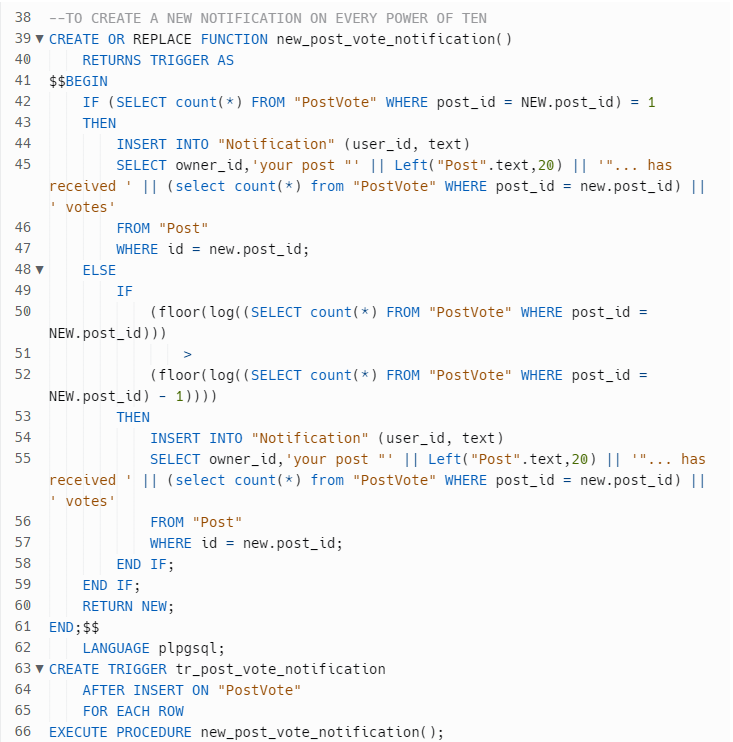 |

| **Trigger**       | TRIGGER02          |
| --------------    | ---                |
| **Description**   | Create a new poll notification on every power of ten.  |
| **SQL Code**      | 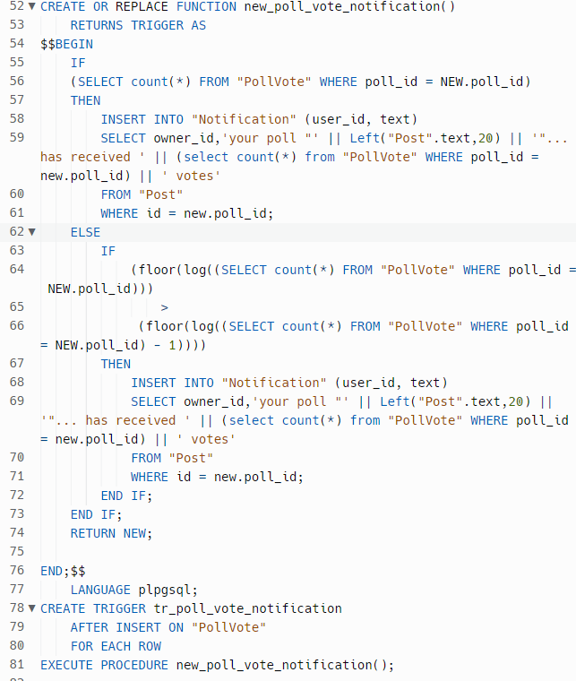 |

| **Trigger**       | TRIGGER03          |
| --------------    | ---                |
| **Description**   | Create a new notification on every invitation.  |
| **SQL Code**      | 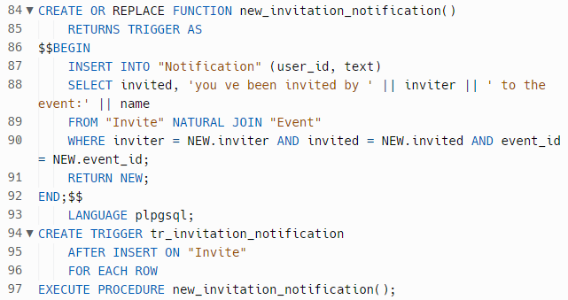 |

| **Trigger**       | TRIGGER04          |
| --------------    | ---                |
| **Description**   | Create a new comment notification on every power of ten.  |
| **SQL Code**      | 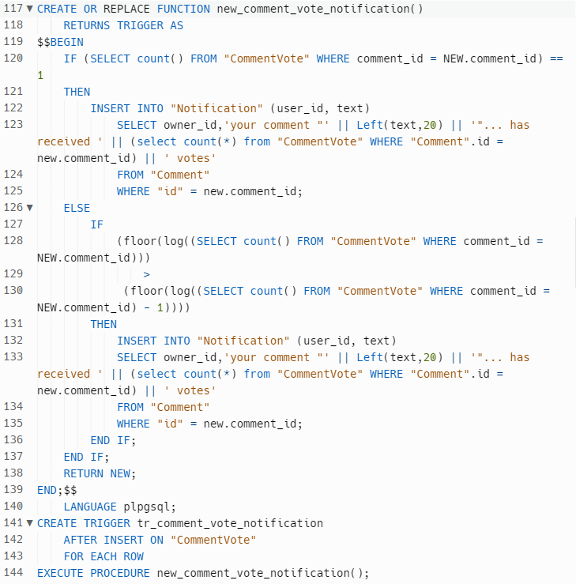 |

| **Trigger**       | TRIGGER05          |
| --------------    | ---                |
| **Description**   | Update the poll vote count.  |
| **SQL Code**      | 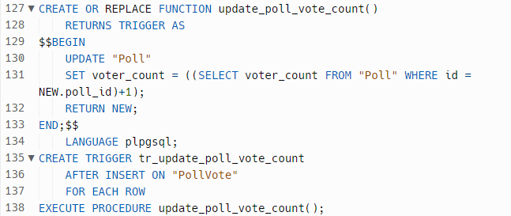 |

| **Trigger**       | TRIGGER06          |
| --------------    | ---                |
| **Description**   | Update the option vote count.  |
| **SQL Code**      | 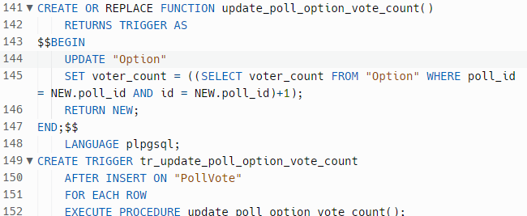 |

| **Trigger**       | TRIGGER07          |
| --------------    | ---                |
| **Description**   | Update the comment total score.  |
| **SQL Code**      | 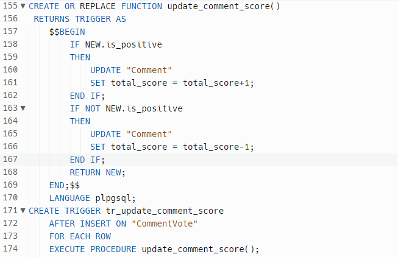 |

| **Trigger**       | TRIGGER08          |
| --------------    | ---                |
| **Description**   | Create the post score.  |
| **SQL Code**      | 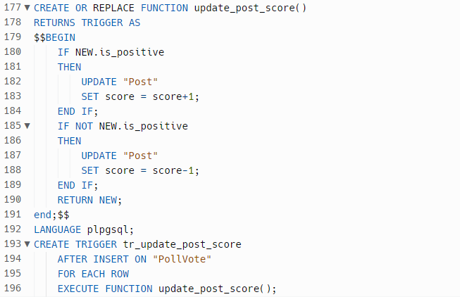 |

| **Trigger**       | TRIGGER09          |
| --------------    | ---                |
| **Description**   | To update post search  |
| **SQL Code**      | 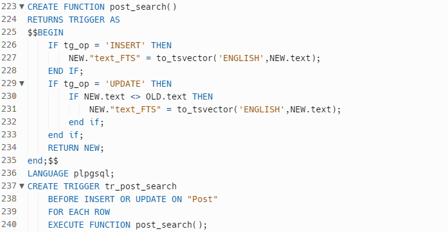 |

| **Trigger**       | TRIGGER10          |
| --------------    | ---                |
| **Description**   | Update event search  |
| **SQL Code**      | 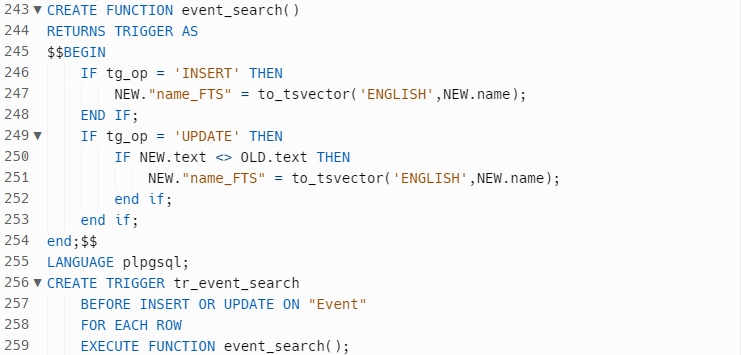 |

| **Trigger**       | TRIGGER11          |
| --------------    | ---                |
| **Description**   | Update location search  |
| **SQL Code**      | 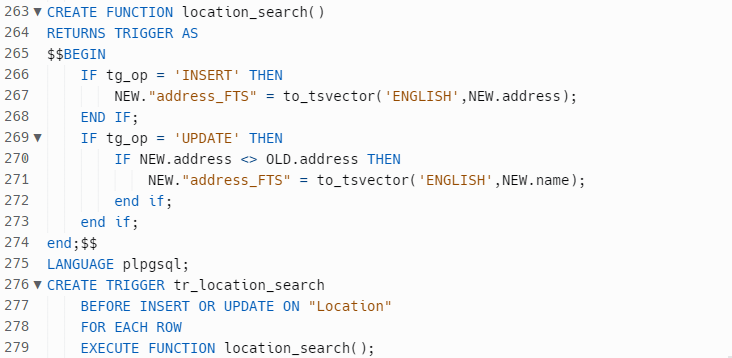 |


### 4. Transactions

| **Transaction**       | TRAN01          |
| --------------    | ---                |
| **Description**   | Get post information |
| **Justification**   | In the middle of the transaction, the update of rows in the comments and events table can occur, which implies that the information retrieved in both selects is different. In order to maintain consistency, it's necessary to use a transaction to ensure that all the code executes without errors. If an error occurs, a ROLLBACK is issued (e.g. when the insertion of a book fails). The isolation level is Repeatable Read, because, otherwise, an update of post_text could happen, due to an insert in the table post committed by a concurrent transaction, and as a result, inconsistent data would be stored. |
| **Isolation level**   | REPEATABLE READ |
| **SQL Code**      | 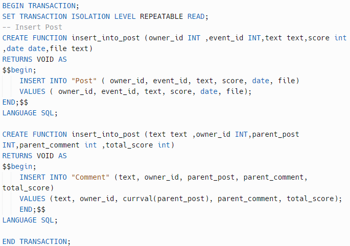 |

| **Transaction**       | TRAN02          |
| --------------    | ---                |
| **Description**   | Get current comment votes as well as information about the items |
| **Justification**   | In the middle of the transaction, the insertion of new rows in the commentvote table can occur, which implies that the information retrieved in both selects is different, consequently resulting in a Phantom Read. It's READ ONLY because it only uses Selects. |
| **Isolation level**   | SERIALIZABLE READ ONLY |
| **SQL Code**      | 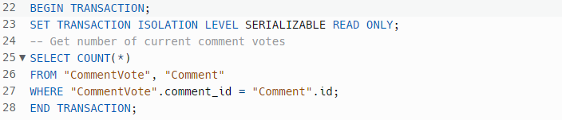 |

| **Transaction**       | TRAN03          |
| --------------    | ---                |
| **Description**   | Get current poll votes as well as information about the items |
| **Justification**   | In the middle of the transaction, the insertion of new rows in the pollvote table can occur, which implies that the information retrieved in both selects is different, consequently resulting in a Phantom Read. It's READ ONLY because it only uses Selects. |
| **Isolation level**   | SERIALIZABLE READ ONLY  |
| **SQL Code**      | 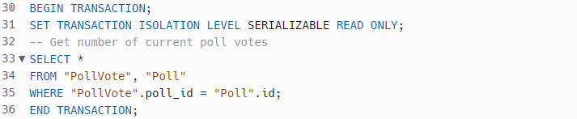 |

| **Transaction**       | TRAN04          |
| --------------    | ---                |
| **Description**   | Get current post votes as well as information about the items |
| **Justification**   | In the middle of the transaction, the insertion of new rows in the postvote table can occur, which implies that the information retrieved in both selects is different, consequently resulting in a Phantom Read. It's READ ONLY because it only uses Selects. |
| **Isolation level**   | SERIALIZABLE READ ONLY  |
| **SQL Code**      | 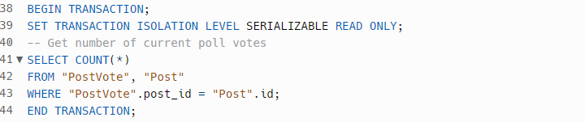 |

| **Transaction**       | TRAN05          |
| --------------    | ---                |
| **Description**   | Get current event as well as information about the items |
| **Justification**   | In the middle of the transaction, the insertion of new rows in the event table can occur, which implies that the information retrieved in both selects is different, consequently resulting in a Phantom Read. It's READ ONLY because it only uses Selects. |
| **Isolation level**   | SERIALIZABLE READ ONLY  |
| **SQL Code**      | 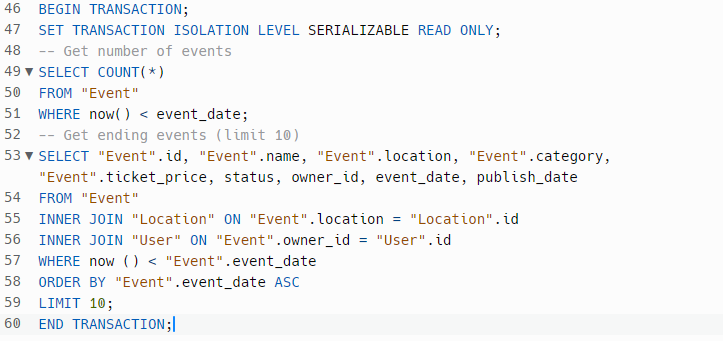 |

### Annex A. Complete SQL Code

#### A. 1 Database schema
```
DROP TABLE IF EXISTS lbaw2235."Location" CASCADE;
DROP TABLE IF EXISTS lbaw2235."Event" CASCADE;
DROP TABLE IF EXISTS lbaw2235."Post" CASCADE;
DROP TABLE IF EXISTS lbaw2235."Poll" CASCADE;
DROP TABLE IF EXISTS lbaw2235."Option" CASCADE;
DROP TABLE IF EXISTS lbaw2235."Comment" CASCADE;
DROP TABLE IF EXISTS lbaw2235."User" CASCADE;
DROP TABLE IF EXISTS lbaw2235."Attend" CASCADE;
DROP TABLE IF EXISTS lbaw2235."Organizer" CASCADE;
DROP TABLE IF EXISTS lbaw2235."Invite" CASCADE;
DROP TABLE IF EXISTS lbaw2235."Notification" CASCADE;
DROP TABLE IF EXISTS lbaw2235."PollVote" CASCADE;
DROP TABLE IF EXISTS lbaw2235."PostVote" CASCADE;
DROP TABLE IF EXISTS lbaw2235."CommentVote" CASCADE;
DROP TYPE IF EXISTS status;

CREATE TYPE status AS ENUM ('public','private','banned');


CREATE TABLE "Location"
(
    "id" SERIAL NOT NULL PRIMARY KEY,
    "address" CHAR(255) NOT NULL,
    "coordinates" TEXT NOT NULL,
    "address_FTS" TSVECTOR
);


CREATE TABLE "User"
(
    "id"       SERIAL  NOT NULL PRIMARY KEY,
    "name"     TEXT    NOT NULL,
    "username" TEXT    NOT NULL UNIQUE,
    "email"    TEXT    NOT NULL UNIQUE,
    "password" TEXT    NOT NULL,
    "photo"    TEXT    NULL
);
CREATE TABLE "Event"
(
    "id"           SERIAL        NOT NULL PRIMARY KEY,
    "name"         CHAR(255)     NOT NULL,
    "location"     INTEGER       NOT NULL REFERENCES "Location"(id),
    "category"     CHAR(255)     NOT NULL,
    "ticket_price" DECIMAL(8, 2) NOT NULL DEFAULT 0,
    "status"       status        NOT NULL DEFAULT 'private',
    "owner_id"     INTEGER       NOT NULL REFERENCES "User"(id),
    "event_date"   DATE          NOT NULL CHECK ( event_date >= NOW() ),
    "publish_date" DATE          NOT NULL CHECK ( publish_date <= now()),
    "name_FTS"     tsvector
);

CREATE TABLE "Attend"
(
    "user_id"  INTEGER NOT NULL REFERENCES "User"(id),
    "event_id" INTEGER NOT NULL REFERENCES "Event"(id),
    PRIMARY KEY ("user_id", "event_id")
);
CREATE TABLE "Organizer"
(
    "user_id"  INTEGER NOT NULL REFERENCES "User"(id),
    "event_id" INTEGER NOT NULL REFERENCES "Event"(id),
    PRIMARY KEY ("user_id", "event_id")
);
CREATE TABLE "Post"
(
    "id"       SERIAL NOT NULL PRIMARY KEY,
    "owner_id" INTEGER NOT NULL REFERENCES "User"(id),
    "event_id" INTEGER NOT NULL REFERENCES "Event"(id),
    "text"     TEXT    NOT NULL,
    "score"    INTEGER NOT NULL DEFAULT 0,
    "date"     DATE    NOT NULL DEFAULT now(),
    "file"     TEXT    NULL,
    "text_FTS" tsvector
);

CREATE TABLE "Poll"
(
    "id"          SERIAL NOT NULL PRIMARY KEY,
    "owner_id"    INTEGER NOT NULL REFERENCES "User"(id),
    "voter_count" INTEGER NOT NULL DEFAULT 0
);
CREATE TABLE "Option"
(
    "id"          SERIAL NOT NULL PRIMARY KEY,
    "poll_id"     INTEGER NOT NULL REFERENCES "Poll"(id),
    "text"        TEXT    NOT NULL,
    "voter_count" INTEGER NOT NULL DEFAULT 0
);
CREATE TABLE "Comment"
(
    "id"             SERIAL NOT NULL PRIMARY KEY ,
    "text"           TEXT    NOT NULL,
    "owner_id"        INTEGER NOT NULL REFERENCES "User"(id),
    "parent_post"    INTEGER NOT NULL REFERENCES "Post"(id),
    "parent_comment" INTEGER NULL REFERENCES "Comment"(id),
    "total_score"    INTEGER NOT NULL default 0
);
CREATE TABLE "Invite"
(
    "inviter"  INTEGER NOT NULL REFERENCES "User"(id),
    "invited"  INTEGER NOT NULL REFERENCES "User"(id)
        check ( "Invite".invited != "Invite".inviter ),
    "event_id" INTEGER NOT NULL REFERENCES "Event"(id),
    PRIMARY KEY ("inviter", "invited", "event_id")
);
CREATE TABLE "Notification"
(
    "id"      SERIAL NOT NULL PRIMARY KEY,
    "user_id" INTEGER NOT NULL REFERENCES "User"(id),
    "date"    DATE    NOT NULL DEFAULT now(),
    "text"    TEXT    NOT NULL
);
CREATE TABLE "PollVote"
(
    "poll_id"     INTEGER NOT NULL REFERENCES  "Poll"(id),
    "user_id"     INTEGER NOT NULL REFERENCES "User"(id),
    option_id     INTEGER NOT NULL REFERENCES "Option"(id),
    PRIMARY KEY ("poll_id", "user_id")
);
CREATE TABLE "PostVote"
(
    "post_id"     INTEGER NOT NULL REFERENCES "Post"(id),
    "user_id"     INTEGER NOT NULL REFERENCES  "User"(id),
    "is_positive" BOOLEAN NOT NULL,
    PRIMARY KEY ("post_id","user_id")
);
CREATE TABLE "CommentVote"
(
    "comment_id"  INTEGER NOT NULL REFERENCES "Comment"(id),
    "user_id"     INTEGER NOT NULL REFERENCES "User"(id),
    "is_positive" BOOLEAN NOT NULL,
    PRIMARY KEY ("comment_id","user_id")
);


```

#### A. 2 Database population
```
DELETE FROM "Attend" CASCADE;
DELETE FROM "Organizer" CASCADE;
DELETE FROM "Comment" CASCADE;
DELETE FROM "PostVote" CASCADE;
DELETE FROM "Post" CASCADE;
DELETE FROM "Invite" CASCADE;
DELETE FROM "Event" CASCADE;
DELETE FROM "Location" CASCADE;
DELETE FROM "PollVote" CASCADE;
DELETE FROM "Option" CASCADE;
DELETE FROM "Poll" CASCADE;
DELETE FROM "Notification" CASCADE;
DELETE FROM "User" CASCADE;
DELETE FROM "CommentVote" CASCADE;


INSERT INTO
    "Location" (id, address, coordinates)
VALUES
    (1, '5539 Anzinger Lane', '37.552470, 98.779710'),
    (2, '03011 Anzinger Trail', '53.535410, 84.099330'),
    (3, '28 Ronald Regan Trail', '26.368370, 44.317820'),
    (4, '487 Vernon Plaza', '50.197630, 52.739830'),
    (5, '9 Coolidge Court', '30.638890, 21.610150'),
    (6, '8929 Red Cloud Avenue', '29.032530, 45.550190'),
    (7, '66 Glendale Junction', '-10.635190, 38.831390'),
    (8, '932 Riverside Drive', '45.427590, -120.818870'),
    (9, '3296 Steensland Street', '53.190790, -0.240780'),
    (10, '494 Oak Park', '56.915180, 62.319850');

INSERT INTO
    "User" (id, name, username, email, password, photo)
VALUES
    (1, 'Wilburt Arens', 'warens0', 'warens0@arstechnica.com', '4800mSY', 'FaucibusCursusUrna.png'),
    (2, 'Mordy Pulbrook', 'mpulbrook1', 'mpulbrook1@aboutads.info', 'gmVNcdL0WhIw', 'OrciNullam.png'),
    (3, 'Haleigh Brikner', 'hbrikner2', 'hbrikner2@webnode.com', 'kKOd6H7O4O', 'LuctusUltriciesEu.jpg'),
    (4, 'Brandea Boldra', 'bboldra3', 'bboldra3@spiegel.de', 'BFTPNY', 'Quam.png'),
    (5, 'Rozamond Jaquet', 'rjaquet4', 'rjaquet4@de.vu', 'sSSqvDw20', 'UltricesPosuere.png'),
    (6, 'Tailor Greatreax', 'tgreatreax5', 'tgreatreax5@youtu.be', '7CIIMcPCzCEj', 'Erat.jpg'),
    (7, 'Ezra Sugarman', 'esugarman6', 'esugarman6@aboutads.info', 'xHcoGBvY', 'EleifendPedeLibero.png'),
    (8, 'Celie Croce', 'ccroce7', 'ccroce7@typepad.com', '1NAEfohde5', 'MattisOdioDonec.png'),
    (9, 'Bing Swash', 'bswash8', 'bswash8@opera.com', 'Pr34Hjlbkf', 'PedeMalesuadaIn.png'),
    (10, 'Carlo Olivazzi', 'colivazzi9', 'colivazzi9@baidu.com', 'mj1ep1CJknN', 'SemperSapienA.jpg');

INSERT INTO
    "Event" (id, name, location, category, ticket_price, status, owner_id, event_date, publish_date)
VALUES
    (1, 'Dreams Evermore', 1, 'Festival', 9.27, 'private', 4, '8/17/2023', '1/2/2022'),
    (2, 'Organic Mania', 2, 'Concert', 91.59, 'private', 7, '9/15/2027', '2/21/2022'),
    (3, 'Prince Hand', 3, 'Conference', 71.87, 'private', 3, '5/17/2024', '10/7/2021'),
    (4, 'Fourplan Blue Meetings', 4, 'Expo', 2.89, 'public', 1, '12/24/2022', '4/5/2021'),
    (5, 'Amalgamated Up Sweet', 5, 'Workshop', 73.52, 'public', 5, '6/5/2025', '1/25/2022'),
    (6, 'Elegant Live Association', 6, 'Politics', 79.36, 'private', 9, '10/20/2028', '4/16/2022'),
    (7, 'Smart Celebration', 7, 'Live TV', 96.82, 'private', 2, '12/28/2026', '10/20/2021'),
    (8, 'Knox Black Connection', 8, 'Protest', 38.42, 'private', 8, '7/21/2024', '7/10/2022'),
    (9, 'Original It Parties', 9, 'Exercise', 58.27, 'public', 6, '2/26/2027', '9/23/2021'),
    (10, 'Star Eventments', 10, 'Auction', 55.22, 'private', 10, '12/24/2022', '8/7/2021');

INSERT INTO
    "Attend" (user_id, event_id)
VALUES
    (1, 5),
    (7, 2),
    (3, 3),
    (10, 8),
    (5, 4),
    (9, 1),
    (7, 7),
    (2, 10),
    (9, 9),
    (4, 10);

INSERT INTO
    "Organizer" (user_id, event_id)
VALUES
    (1, 1),
    (2, 2),
    (3, 3),
    (4, 4),
    (5, 5),
    (6, 6),
    (7, 7),
    (8, 8),
    (9, 9),
    (10, 10);

INSERT INTO
    "Post" (id, owner_id, event_id, text, score, date, file)
VALUES
    (1, 1, 6, 'etiam faucibus cursus urna ut tellus nulla ut erat id mauris vulputate elementum nullam varius nulla facilisi cras non velit', 0, '3/6/2022', 'DapibusAugue.png'),
    (2, 2, 2, 'luctus et ultrices posuere cubilia curae duis faucibus accumsan odio curabitur convallis duis consequat dui nec nisi volutpat eleifend donec', 64, '9/23/2022', 'NuncVestibulumAnte.mp3'),
    (3, 8, 3, 'congue diam id ornare imperdiet sapien urna pretium nisl ut volutpat', 0, '12/2/2021', 'Morbi.tiff'),
    (4, 1, 4, 'iaculis diam erat fermentum justo nec condimentum neque sapien placerat ante nulla justo', 32, '8/3/2022', 'ArcuAdipiscingMolestie.ppt'),
    (5, 5, 3, 'morbi quis tortor id nulla ultrices aliquet maecenas leo odio condimentum', 3, '11/7/2021', 'Libero.tiff'),
    (6, 3, 10, 'amet sapien dignissim vestibulum vestibulum ante ipsum primis in faucibus', 86, '10/11/2022', 'MagnaVulputateLuctus.xls'),
    (7, 7, 3, 'donec ut mauris eget massa tempor convallis nulla neque libero', 48, '6/7/2022', 'InLeo.tiff'),
    (8, 10, 1, 'nunc rhoncus dui vel sem sed sagittis nam congue risus semper porta', 27, '1/24/2022', 'DolorVelEst.gif'),
    (9, 9, 5, 'dui luctus rutrum nulla tellus in sagittis dui vel nisl duis ac nibh fusce lacus purus', 0, '1/2/2022', 'SapienDignissimVestibulum.png'),
    (10, 4, 10, 'quis tortor id nulla ultrices aliquet maecenas leo odio condimentum id luctus nec molestie sed justo', 8, '7/24/2022', 'In.ppt');

INSERT INTO
    "Poll" (id, owner_id, voter_count)
VALUES
    (1, 1, 0),
    (2, 2, 93),
    (3, 3, 8),
    (4, 4, 77),
    (5, 5, 11),
    (6, 6, 0),
    (7, 7, 48),
    (8, 8, 42),
    (9, 9, 0),
    (10, 10, 7);

INSERT INTO
    "Option" (id, poll_id, text, voter_count)
VALUES
    (1, 1, 'ligula in lacus curabitur at ipsum ac tellus semper interdum mauris ullamcorper purus sit amet nulla quisque', 27),
    (2, 2, 'nam dui proin leo odio porttitor id consequat in consequat ut nulla sed accumsan felis ut at dolor quis odio', 1),
    (3, 3, 'lorem id ligula suspendisse ornare consequat lectus in est risus auctor sed tristique in tempus sit amet sem fusce', 13),
    (4, 4, 'sem duis aliquam convallis nunc proin at turpis a pede posuere nonummy integer non velit', 25),
    (5, 5, 'eget vulputate ut ultrices vel augue vestibulum ante ipsum primis', 6),
    (6, 6, 'pretium iaculis diam erat fermentum justo nec condimentum neque sapien', 0),
    (7, 7, 'maecenas leo odio condimentum id luctus nec molestie sed justo pellentesque viverra pede ac diam cras pellentesque volutpat dui', 81),
    (8, 8, 'integer a nibh in quis justo maecenas rhoncus aliquam lacus morbi', 88),
    (9, 9, 'tortor quis turpis sed ante vivamus tortor duis mattis egestas metus aenean fermentum donec ut mauris', 69),
    (10, 10, 'lacinia eget tincidunt eget tempus vel pede morbi porttitor lorem id', 0);

INSERT INTO
    "Comment" (id, text, owner_id, parent_post, parent_comment, total_score)
VALUES
    (1, 'proin at turpis a pede posuere nonummy integer non velit donec diam', 1, 1, 1, 0),
    (2, 'amet erat nulla tempus vivamus in felis eu sapien cursus vestibulum proin eu mi nulla ac enim in tempor', 2, 2, 2, 6),
    (3, 'metus arcu adipiscing molestie hendrerit at vulputate vitae nisl aenean lectus pellentesque eget nunc donec', 3, 3, 3, 86),
    (4, 'arcu adipiscing molestie hendrerit at vulputate vitae nisl aenean lectus pellentesque eget nunc', 4, 4, 4, 41),
    (5, 'sit amet nulla quisque arcu libero rutrum ac lobortis vel dapibus', 5, 5, 5, 23),
    (6, 'ut suscipit a feugiat et eros vestibulum ac est lacinia nisi venenatis tristique fusce congue diam id ornare', 6, 6, 6, 2),
    (7, 'proin at turpis a pede posuere nonummy integer non velit donec diam neque vestibulum', 7, 7, 7, 2),
    (8, 'eget elit sodales scelerisque mauris sit amet eros suspendisse accumsan tortor quis turpis sed ante vivamus tortor duis mattis egestas', 8, 8, 8, 32),
    (9, 'ut erat curabitur gravida nisi at nibh in hac habitasse', 9, 9, 9, 0),
    (10, 'in hac habitasse platea dictumst morbi vestibulum velit id pretium iaculis diam erat', 10, 10, 10, 17);

INSERT INTO
    "Invite" (inviter, invited, event_id)
VALUES
    (1, 6, 1),
    (2, 1, 2),
    (3, 2, 3),
    (4, 9, 4),
    (5, 10, 5),
    (6, 3, 6),
    (7, 5, 7),
    (8, 4, 8),
    (9, 8, 9),
    (10, 7, 10);

INSERT INTO
    "Notification" (id, user_id, date, text)
VALUES
    (1, 1, '10/21/2022', 'donec vitae nisi nam ultrices libero non mattis pulvinar nulla pede ullamcorper augue'),
    (2, 2, '10/21/2022', 'mauris laoreet ut rhoncus aliquet pulvinar sed nisl nunc rhoncus dui vel sem sed sagittis'),
    (3, 3, '10/21/2022', 'elit sodales scelerisque mauris sit amet eros suspendisse accumsan tortor quis turpis sed ante vivamus tortor duis mattis egestas'),
    (4, 4, '10/20/2022', 'pede libero quis orci nullam molestie nibh in lectus pellentesque at nulla suspendisse potenti cras in purus eu magna'),
    (5, 5, '10/22/2022', 'ultrices phasellus id sapien in sapien iaculis congue vivamus metus arcu adipiscing molestie hendrerit'),
    (6, 6, '10/21/2022', 'consectetuer eget rutrum at lorem integer tincidunt ante vel ipsum praesent blandit lacinia erat vestibulum sed magna'),
    (7, 7, '10/20/2022', 'magna ac consequat metus sapien ut nunc vestibulum ante ipsum primis in faucibus orci'),
    (8, 8, '10/18/2022', 'a pede posuere nonummy integer non velit donec diam neque vestibulum eget vulputate ut ultrices vel augue vestibulum ante ipsum'),
    (9, 9, '10/21/2022', 'consequat nulla nisl nunc nisl duis bibendum felis sed interdum venenatis turpis enim blandit mi in porttitor pede'),
    (10, 10, '10/17/2022', 'platea dictumst aliquam augue quam sollicitudin vitae consectetuer eget rutrum at lorem integer tincidunt ante vel ipsum praesent');

INSERT INTO
    "PollVote" (poll_id, user_id, option_id)
VALUES
    (1, 1, 1),
    (2, 2, 2),
    (3, 3, 3),
    (4, 4, 4),
    (5, 5, 5),
    (6, 6, 6),
    (7, 7, 7),
    (8, 8, 8),
    (9, 9, 9),
    (10, 10, 10);

INSERT INTO
    "PostVote" (post_id, user_id, is_positive)
VALUES
    (1, 1, true),
    (2, 2, true),
    (3, 3, true),
    (4, 4, false),
    (5, 5, true),
    (6, 6, false),
    (7, 7, true),
    (8, 8, false),
    (9, 9, false),
    (10, 10, true);

INSERT INTO
    "CommentVote" (comment_id, user_id, is_positive)
VALUES
    (1, 1, false),
    (2, 2, false),
    (3, 3, true),
    (4, 4, false),
    (5, 5, false),
    (6, 6, false),
    (7, 7, true),
    (8, 8, false),
    (9, 9, false),
    (10, 10, true);
```
## Revision history

Changes made to the first submission:

1. No changes were made yet.


***

GROUP2235, 22/10/2022

* Diogo Pinto, up201906067@up.pt (Editor)
* Eduardo Duarte, up202004999@up.pt
* Marcelo Apolinário, up201603903@up.pt
* Ricardo Cruz, up202008789@up.pt

