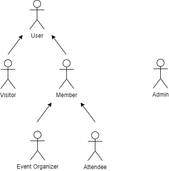
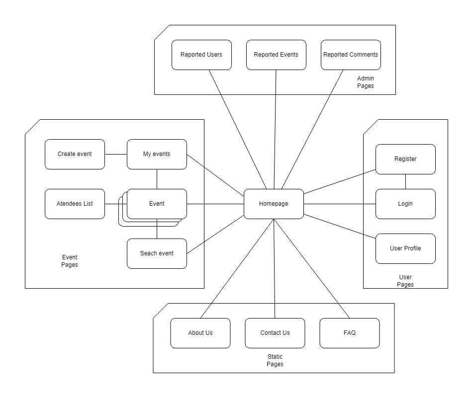
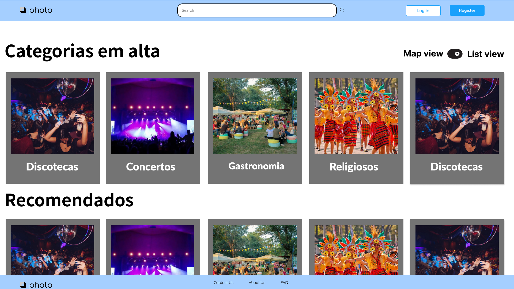
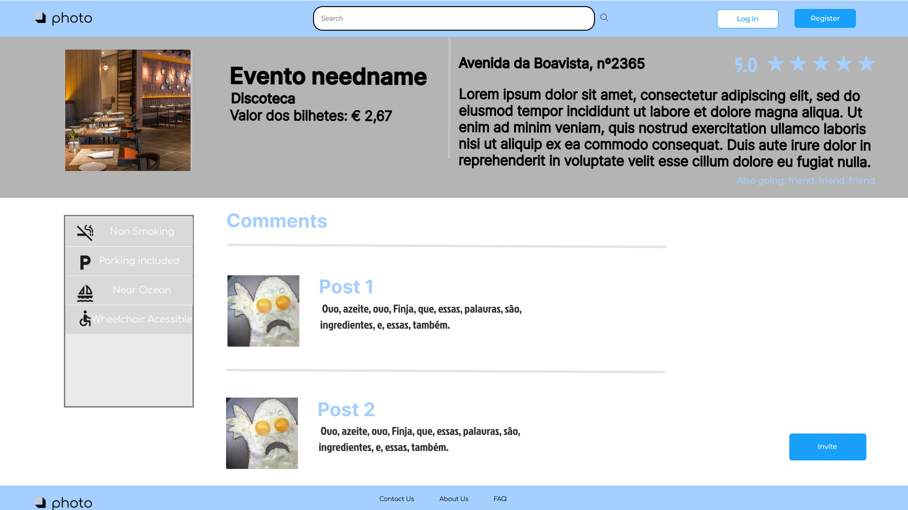

# ER: Requirements Specification Component

Helluva is an information system with a web interface to collaboratively manage events.

## A1: Helluva
Helluva is an event management platform that focuses on meeting the diversity of users, always looking for the greatest possible variety of events, cataloging them in an objective and easy to find way.\
The site is composed of a feed with several categories of events where the user can find options that best fit their preferences. There is also a header that gives the possibility to search for events by their name or address, making it even easier to search for such events.
Analyzing the unmet needs in relation to the event management branch, Helluva was created, an application to share said events.\
\
Users can create events, generate invite links, as well as to edit or delete said created events. Users can authenticate using e-mail/password or using Google. Can search using a search bar. There are two view options: map view and list view.\
Map view shows events close to the user’s location using Google Maps and pointers that can be pressed to access additional information. The list view shows several lists of events, divided by categories. Both have filtering options and won’t show private or past events.\
Users can search for an event based on its name or location and can also access an event using an invite link. Private events won’t appear on searches.\
Events have a post feed, these posts  can get comments and votes. There are also extra features like the support of pools and allows users to select if they are going to said event.Can be public or private.\
Users receive notifications every time info about an event they are attending changes. They also receive notifications when comments get replies and when someone confirms their attendance at a private event too.\
\
User groups:
* Non-Authenticated: Can access all the public information across the platform, basically a read-only mode.
* Authenticated: Can do all the previous group can, besides being able to interact with events and edit account data. Can be an event manager.
* Event manager: Can do all the previous group can, but has management roles inside their own event, those being edit, delete comments and change privacy settings.
* Administrators: Can delete events, comments and user accounts.

***

## A2: Actors and User stories
This artifact contains the documentation about the actors and their respective user stories. It also includes the supplementary requirements: business rules, technical requirements and restrictions to the system.

### 1. Actors

Figure 1: Helluva actors.

|Identifier|Description|
|:---:|:---:|
| User | Generic user that has access to public information, such as public events and member's profiles. |
| Visitor | Unauthenticated user that is able to sign-up or sign-in in the system. |
| Member | Authenticated user that has access to public information and is able to manage it (create event, report event, manage invitations). |
| Event Organizer | Authenticated user that is able to manage their own events (edit, create polls, cancel event). |
| Attendee | Authenticated user that as signed-up for the event and is able to comment, upload files and view attendee list. |
| Admin | Authenticated user that is responsible for the management of content, user´s accounts and event reports. |

Table 1: Helluva actors description.

### 2. User Stories

#### 2.1. Visitor
|Identifier|Name|Priority|Description|
|:---:|:---:|:---:|:---:|
| US01 | Sign-in | High | As a *Visitor*, I want to authenticate into the system, so that I can access priviliged information. |
| US02 | Sign-up | High | As a *Visitor*, I want to register an account, so that I can authenticate myself into the system. |
| US48 | Recover password | Low | As a *Visitor*, I want to recover my password, so that I can access my account again. |

Table 2: Visitor user stories.

#### 2.2. User
|Identifier|Name|Priority|Description|
|:---:|:---:|:---:|:---:|
| US03 | See Home | High | As a *User*, I want to access the 'Home' page, so that I can see a brief presentation of the website. |
| US04 | See About | High | As a *User*, I want to access the 'About' page, so that I can see a complete description of the website and its creators. |
| US05 | Browse Public Events | High | As a *User*, I want to browse through public events, so that I can see the current available public events on the website. |
| US06 | View Public Event | High | As a *User*, I want to view a public event, so that I can see more detailed information about it. |
| US07 | Search Events | High | As a *User*, I want to search for events, so that I can more easily find events I'm interested in. |
| US08 | Explore Events by Tag | Medium | As a *User*, I want to explore events by tags, so that I can filter events for specific themes. |
| US45 | See FAQ | High | As a *User*, I want to access the 'FAQ' page, so that I can see the answers to the most common questions. |

Table 3: User user stories.

#### 2.3. Member
|Identifier|Name|Priority|Description|
|:---:|:---:|:---:|:---:|
| US09 | Create Event | High | As a *Member*, I want to create an event, so that I can garner attention and people for it. |
| US10 | Invite Users to Public Event | High | As a *Member*, I want to invite users to a public event, so that I can bring more people in to attend it. |
| US11 | Manage Own Events | High | As a *Member*, I want to manage my own events, so that I can keep track and update them. |
| US12 | Manage Events Attended / to Attend | High | As a *Member*, I want to manage events I've attended or want to attend, so that I can track and keep a history of them. |
| US13 | Request to Join Event | Medium | As a *Member*, I want to request to join an event, so that I can attend it and interact with people who are also attending it. |
| US14 | Purchase Ticket to Event | Low | As a *Member*, I want to purchase a ticket for an event, so that I can gain access to it. |
| US15 | Support Events | Low | As a *Member*, I want to support an event, so that I can assist in its concretization and potentially earn a few perks. |
| US16 | Report Events | Low | As a *Member*, I want to report an event, so that I can let the administrators know that the event violates the rules of the website. |
| US17 | Manage Invitations | Low | As a *Member*, I want to manage the invitations I send and receive, so that I can track them and accept or reject received invitations. |
| US44 | Logout | High | As a *Member*, I want to logout, so that other users can authenticate. |
| US46 | Edit profile | High | As a Member, I want to edit my profile, so that I can keep it up to date. |
| US47 | View own profile | High | As a Member, I want to view my own profile, so that I get easy access to everything related to it. |

Table 4: Member user stories.

#### 2.4 Event Organizer

| Identifier | Name | Priority | Description |
|:----------:|:------:|:------:|:------:|
| US18 | Edit Event Details | High | As an *Event Organizer*, I want to edit event details, so that I keep everything updated. |
| US19 | Add User to Event | High | As an *Event Organizer*, I want to add an user to the event, so that he can participate. |
| US20 | Manage Event Participants | High | As an *Event Organizer*, I want to manage event participants, so that I can add or remove any participant. |
| US21 | Create Polls | Medium | As an *Event Organizer*, I want to create polls, so that participants can vote and have their opinion count. |
| US22 | Cancel Event | Medium | As an *Event Organizer*, I want to cancel an event, so that participants are aware that the event is not going to happen anymore. |
| US23 | Manage Event Visibility | Medium | As an *Event Organizer*, I want to manage event visibility, so that I know it is reaching the public I want. |
| US24 | Manage Available Tickets | Low | As an *Event Organizer*, I want to manage available tickets, so that the event doesn't get under or overcrowded. |
| US25 | Send Event Invitations | Low | As an *Event Organizer*, I want to send event invitations, so that users can join the event. |
| US26 | Manage Join Requests in Public Events | Low | As an *Event Organizer*, I want to manage join requests in public events, so that I know who will participate in the event. |
| US27 | Access Statistics on Event Participation | Low | As an *Event Organizer*, I want to access statistics on an event participation, so that I know if the event is popular or not. |

Table 5: Event Organizer user stories.

#### 2.5 Attendee

| Identifier | Name | Priority | Description |
|:----:|:--------:|:------:|:----------------:|
| US28 | View Event Messages | Medium | As an *Attendee*, I want to view event messages, so that I am aware of any updates on the event. |
| US29 | Add Comments | Medium | As an *Attendee*, I want to add comments, so that I can share my opinion about the event. |
| US30 | Answer Polls | Medium | As an *Attendee*, I want to answer polls, so that my vote and opinion counts. |
| US31 | Upload Files | Medium | As an *Attendee*, I want to upload files, so that I can share my data or documents, if needed. |
| US32 | Vote in Comments | Medium | As an *Attendee*, I want to vote in comments, so that I can show my opinion on a comment. |
| US33 | View Attendees List | Medium | As an *Attendee*, I want to view attendees list, so that I know who will participate in the event. |
| US34 | Leave Event | Medium | As an *Attendee*, I want to leave an event, so that I can show that I'm not interested anymore. |
| US35 | View Event Tickets | Low | As an *Attendee*, I want to view event tickets, so that I can acquire mine and attend to the event. |
| US49 | Edit Comments | Medium | As an *Attendee*, I want to edit my own comments, so that I keep them updated. |
| US50 | Delete Comments | Medium | As an *Attendee*, I want to delete my own comments, so that I’m not sharing wrong information. |

Table 6: Attendee user stories.

#### 2.6 Admin

| Identifier | Name | Priority | Description |
|:----:|:--------:|:------:|:----------------:|
| US36 | Administer User Accounts | High | As an *Admin*, I want to administer user accounts, so that I can search, view, edit and create user accounts. |
| US37 | Block user accounts | Medium | As an *Admin*, I want to block user accounts, so that they can no longer access restricted content for a specific period of time. |
| US38 | Unblock user accounts | Medium | As an *Admin*, I want to unblock user accounts, so that they can now access restricted content again. |
| US39 | Delete user accounts | Medium | As an *Admin*, I want to delete user accounts, so that they can no longer access restricted content. |
| US40 | Browse Events | Medium | As an *Admin*, I want to browse events, so that I can find what event I'm looking for. |
| US41 | View Event Details | Medium | As an *Admin*, I want to view event details, so that I know everything about that event. |
| US42 | Manage Event Reports | Medium | As an *Admin*, I want to manage event reports, so that I can verify the reported event and take measures. |
| US43 | Delete Event | Medium | As an *Admin*, I want to delete an event, so that the system doesn't have inappropriate events or content. |

Table 7: Admin user stories.

### 3. Supplementary Requirements

#### 3.1. Business Rules
|Identifier|Name|Description|
|:---:|:---:|:---:|
| BR01 | Event Types | Events on the website can be made either public or private. Public events are shown in search results, whereas private events aren't. |
| BR02 | Administrative Independence | Administrator accounts are independent of the user accounts, i.e. administrator accounts cannot create or participate in events. |
| BR03 | Deleted User History | When a user deletes their account, the events and comments belonging to them are kept in order to uphold consistency. |
| BR04 | Own Item Interaction | A user can both comment and vote on their own comments. |
| BR05 | Event Date | The date for an event must be greater than the date of its creation. |

Table 8: Helluva business rules.

#### 3.2. Technical Requirements
|Identifier|Name|Description|
|:---:|:---:|:---:|
| TR01 | Availability | The system must be available 99 percent of the time in each 24-hour period. |
| TR02 | Accessibility | The system must ensure that everyone can access the pages, regardless of whether they have any handicap or not, or the web browser they use. |
| **TR03** | **Usability** | **The system should be simple, intuitive, and easy to use.    The system's aim is to be used by the general population, therefore it's critical to ensure anyone, regardless of their techincal experience, is able to easily navigate around the system.**|
| TR04 | Performance | The system should have response times shorter than 2 s to ensure the user's attention. |
| TR05 | Web application |The system should be implemented as a web application with dynamic pages (HTML5, JavaScript, CSS3 and PHP). |
| TR06 | Portability | The server-side system should work across multiple platforms (Linux, Mac OS, etc.). |
| **TR07** | **Database** | **The PostgreSQL database management system must be used, with a version of 11 or higher.    It's critical to use up to date tools so that the system retains both high functionality and longevity.**|
| **TR08** | **Security** | **The system shall protect information from unauthorised access through the use of an authentication and verification system.    Helluva holds personal information about each user, therefore it's very important to keep that information secured and protected.** |
| TR09 | Robustness | The system must be prepared to handle and continue operating when runtime errors occur. |
| TR10 | Scalability | The system must be prepared to deal with the growth in the number of users and their actions. |
| TR11 | Ethics | The system must respect the ethical principles in software development (for example, personal user details, or usage data, should not be collected nor shared without full acknowledgement and authorization from its owner). |

Table 9: Helluva techinal requirements.

#### 3.3. Restrictions
|Identifier|Name|Description|
|:---:|:---:|:---:|
| C01 | Deadline | The system must be ready to be used, with its mandatory requirements implemented, by the end of the Christmas holidays. |

Table 10: Helluva project restrctions.

## A3: Information Architecture
The Information Architecture artifact presents a brief overview of the information architecture of the system to be developed.

### 1. Sitemap

Figure 2: Helluva sitemap.

### 2. Wireframes

Figure 3: Helluva Homepage.

Figure 4: Helluva Event Page.

***

## Revision history

Changes made to the first submission:

1. Added US44, US45, US46, US47, US48, US49 and US50.

***

GROUP2235, 01/10/2022

* Diogo Pinto, up201906067@up.pt (Editor)
* Eduardo Duarte, up202004999@up.pt
* Marcelo Apolinário, up201603903@up.pt
* Ricardo Cruz, up202008789@up.pt
